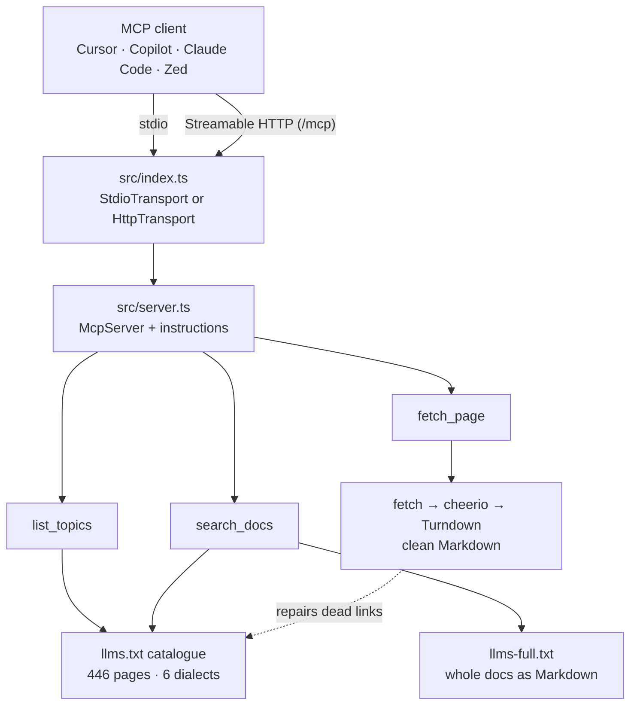

# MCP Architecture: drizzle-docs-mcp

How the server is put together. It runs on [`tmcp`](https://tmcp.io), a small
TypeScript SDK: the server itself is transport agnostic (JSON-RPC over Web
standards), and the entrypoint decides whether it speaks **stdio** or
**Streamable HTTP**.

## Layers

| Layer     | File                | Responsibility                                                                                                     |
| --------- | ------------------- | ------------------------------------------------------------------------------------------------------------------ |
| Config    | `src/lib/config.ts` | Every knob, read from the environment (`DOCS_BASE_URL`, cache TTL, transport, port, host, path)                    |
| Data      | `src/lib/docs.ts`   | The `llms.txt` catalogue, page fetching + HTML→Markdown, the `llms-full.txt` corpus, caching, the dialect fallback |
| Search    | `src/lib/search.ts` | Fuse.js indexes for the fast (title/section) and deep (content) search, plus snippet extraction                    |
| Tools     | `src/tools/*.ts`    | The three MCP tools and their zod schemas                                                                          |
| Server    | `src/server.ts`     | Builds the `McpServer`, sets capabilities/instructions, registers the tools                                        |
| Transport | `src/index.ts`      | Picks stdio or HTTP, serves `/` info + health, warms the catalogue                                                 |

## Data flow

1. **Catalogue.** `fetchIndex()` downloads `llms.txt` once and parses it into
   `{title, slug, url, dialect, section}` entries. Section headings like
   `## pg/Migrations` give the dialect and section; the dialect list is derived
   from those headings, never hardcoded. If `llms.txt` is missing, it falls back
   to scraping the `/docs/overview` sidebar (one DOM pass).
2. **Search.** `search_docs` runs over that catalogue (`depth: "index"`, a few
   milliseconds) or over `llms-full.txt` (`depth: "full"`, one download of a few
   MB, then a content index with snippets).
3. **Read.** `fetch_page` downloads one page, strips navigation/sidebars with
   cheerio, converts it with Turndown, and caches the Markdown for an hour.
4. **Respond.** Each tool returns `{content: [{type: "text", text}]}`; failures
   return `isError: true` with a readable message, because the model is the one
   that has to recover from them.

## The catalogue quirk (why some links need a second try)

Drizzle lists shared pages under _every_ dialect section — `## pg/meet drizzle`
points at `/docs/pg/overview` — but the site only serves the unprefixed path.
Auditing all 446 catalogue links against the live site:

- **375** resolve directly,
- **71** return 404 — every one of them a dialect-prefixed shared page,
- **71/71** work with the dialect segment removed (`/docs/pg/overview` →
  `/docs/overview`).

`pageCandidates()` therefore tries the URL as listed, then — only when the path
segment is one the catalogue itself reports as a dialect — retries unprefixed.
That check matters: `/docs/get-started/postgresql-new` is a real deep path and
must never be rewritten. After a successful second try, `repairEntry()` updates
the in-memory catalogue, so `list_topics` and `search_docs` advertise the URL
that actually works from then on.

## Caching

- Index, pages and corpus all live in memory with a configurable TTL
  (`DOCS_CACHE_TTL_MS`, default one hour).
- Index fetches are de-duplicated in flight, so ten concurrent first calls make
  one request.
- There is **no startup pre-cache**: the old server fetched all 97 pages before
  it could search; the catalogue is one request and pages are fetched on demand.
  HTTP mode warms the catalogue in the background for a faster first search.

## Transports

| Mode            | Start                                             | Endpoint                                                             |
| --------------- | ------------------------------------------------- | -------------------------------------------------------------------- |
| stdio (default) | `npx drizzle-docs-mcp`                            | stdin/stdout — logs go to **stderr**, because stdout is the protocol |
| HTTP            | `drizzle-docs-mcp --http` or `MCP_TRANSPORT=http` | `POST/GET/DELETE` on `/mcp` (`MCP_PATH`), plus `/` for info/health   |

The HTTP transport is configured with `cors: true` and `allowedOrigins: true`
(this is a public, read-only docs server); swap both for an origin list if you
put it behind something private.

## Versioning

`src/server.ts` reads `package.json` for the name, version and description it
reports over MCP, so the npm version and the `serverInfo` a client sees are the
same value by construction. `dist/` is generated by `tsc -p tsconfig.build.json`
— never edit it by hand.

## Design principles

- **AI-optimised output**: navigation stripped, clean Markdown, sections and
  `maxLength` so a caller can keep its context small.
- **Follow the docs' own structure**: `llms.txt`/`llms-full.txt` rather than
  scraping and guessing; the tools expose dialects and sections because the docs
  do.
- **Configure, don't hardcode**: hosts, TTL and transport come from the
  environment.
- **No hidden network storms**: one request for the catalogue, on-demand pages,
  an hour of caching.
